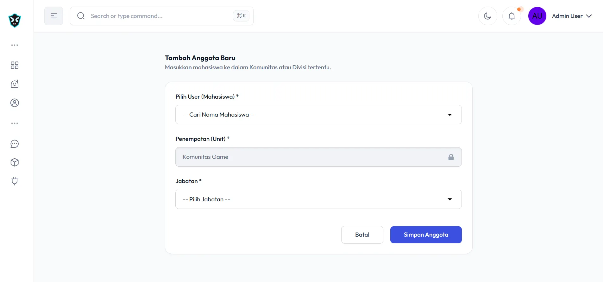

# RIT Organization Management System

Aplikasi **RIT Organization Management System** adalah aplikasi berbasis web yang dikembangkan untuk mendukung pengelolaan organisasi **RIT (Republic of Information Technology)** secara terpusat, efisien, dan terstruktur.

Aplikasi ini dibangun menggunakan **Laravel**, **MySQL**, dan **TailAdmin** sebagai template antarmuka, dengan fokus utama pada **manajemen proyek organisasi** sebagai fitur unggulan.

---

## 🚀 Fitur Utama

### 1. Manajemen Struktur Organisasi & Anggota

* Pengelolaan struktur organisasi
* Manajemen data anggota
* Pengelompokan anggota berdasarkan jabatan/divisi

### 2. Manajemen Proyek (Fitur Unggulan)

* Pembuatan dan pengelolaan proyek organisasi
* Penugasan anggota ke dalam proyek
* Monitoring progres proyek
* Dokumentasi dan arsip proyek

### 3. Manajemen Inventaris

* Pencatatan barang/inventaris organisasi
* Status ketersediaan barang
* Riwayat penggunaan inventaris

### 4. Manajemen Keuangan

* Pencatatan pemasukan dan pengeluaran
* Laporan keuangan
* Monitoring saldo organisasi

### 5. Manajemen Surat-Menyurat

* Pengelolaan surat masuk dan surat keluar
* Arsip digital surat
* Kategori dan pencarian surat

---

## 🛠️ Teknologi yang Digunakan

* **Backend**: Laravel
* **Frontend**: TailAdmin (Tailwind CSS)
* **Database**: MySQL
* **Version Control**: Git & GitHub
---

## ✨ Fitur Lainnya

* 🚀 **Laravel 12 Core** - Built on the latest Laravel release with improved routing, security, and Blade templating
* 🎨 **Tailwind CSS v4** - Utility-first styling for rapid, consistent UI development
* ⚡ **Alpine.js Interactivity** - Lightweight reactivity without a heavy JavaScript framework
* ⚡ **Sortable Js** - Interaktif tampilan perpindahan menu
* 📦 **Vite Build System** - Fast dev server, instant HMR, and optimized production builds
* 📱 **Fully Responsive Layouts** - Smooth, mobile-first design that adapts across all screen sizes
* 🌙 **Built-in Dark Mode** - Ready-to-use modern dark theme for better usability and aesthetics
* 📊 **Advanced UI Components** - Charts, data tables, forms, calendars, modals, and reusable blocks for complex dashboards
* 🎯 **Production-Ready Dashboard UI** - Clean, modern interface crafted for real apps, not placeholder demos

---
## 📋 Requirements
Untuk Menginstall Aplikasi ini pastikan environtment anda memenuhi :

* **PHP 8.2+**
* **Composer** (PHP dependency manager)
* **Node.js 18+** and **npm** (for compiling frontend assets)
* **Database** - Works with SQLite (default), MySQL, or PostgreSQL

### Check Your Environment

Verify your installations:

```bash
php -v
composer -V
node -v
npm -v
```

---
## 📦 Instalasi

Ikuti langkah-langkah berikut untuk menjalankan aplikasi ini secara lokal:

### 1. Clone Repository

```bash
git clone https://github.com/FauzanFaiz17/RIT-WEB-Laravel-.git
cd RIT-WEB-Laravel-
```

### 2. Install Dependency

```bash
composer install
```
### 3: Install Node.js Dependencies

```bash
npm install
```

atau jika kamu lebih prefer yarn atau pnpm:

```bash
# Using yarn
yarn install

# Using pnpm
pnpm install
```

### 4: Install sortablejs Dependencies

```bash
npm install sortablejs
```

### 5. Konfigurasi Environment

Salin file `.env.example` menjadi `.env` lalu sesuaikan konfigurasi database:

```bash
cp .env.example .env
```
**For Windows users:**

```bash
copy .env.example .env
```
**Or create it programmatically:**

```bash
php -r "file_exists('.env') || copy('.env.example', '.env');"
```

```env
DB_CONNECTION=mysql
DB_HOST=127.0.0.1
DB_PORT=3306
DB_DATABASE=nama_database
DB_USERNAME=your_username
DB_PASSWORD=your_password
```
Membuat database:

```bash
# MySQL
mysql -u root -p -e "CREATE DATABASE tailadmin_db;"

# PostgreSQL
createdb tailadmin_db
```

### 6. Generate Application Key

```bash
php artisan key:generate
```

### 7. Migrasi Database & Seeder

```bash
php artisan migrate --seed
```

### 8: Storage Link

Create a symbolic link for file storage:

```bash
php artisan storage:link
```

### 9. Jalankan Server

```bash
php artisan serve
```

Aplikasi dapat diakses melalui `http://localhost:8000`

---

### Terminal kedua

Jangan lupa menjalankan frontendnya dengan menjalankan script:

```bash
composer run dev
```


## 👤 Role & Akses (Opsional)

* **Admin**: Mengelola seluruh fitur aplikasi
* **Pengurus**: Mengelola data sesuai divisi
* **Anggota**: Melihat informasi dan proyek yang diikuti

---

## 📁 Struktur Folder (Ringkas)


```
RIT-WEB-Laravel-/
├── app/                    # Application logic
│   ├── Http/              # Controllers, Middleware, Requests
│   ├── Models/            # Eloquent models
│   └── Providers/         # Service providers
├── bootstrap/             # Framework bootstrap files
├── config/                # Configuration files
├── database/              # Migrations, seeders, factories
│   ├── migrations/
│   ├── seeders/
│   └── factories/
├── public/                # Public assets (entry point)
│   ├── build/            # Compiled assets (generated)
│   └── index.php         # Application entry point
├── resources/             # Views and raw assets
│   ├── css/              # Stylesheets (Tailwind)
│   ├── js/               # JavaScript files (Alpine.js)
│   └── views/            # Blade templates
├── routes/                # Route definitions
│   ├── web.php           # Web routes
│   ├── api.php           # API routes
│   └── console.php       # Console routes
├── storage/               # Logs, cache, uploads
│   ├── app/
│   ├── framework/
│   └── logs/
├── tests/                 # Pest test files
│   ├── Feature/
│   └── Unit/
├── .env.example           # Example environment file
├── artisan                # Artisan CLI
├── composer.json          # PHP dependencies
├── package.json           # Node dependencies
├── vite.config.js         # Vite configuration
└── tailwind.config.js     # Tailwind configuration
```

---

## 🤝 Kontribusi

Kontribusi sangat terbuka untuk pengembangan aplikasi ini.

Langkah kontribusi:

1. Fork repository
2. Buat branch fitur baru
3. Commit perubahan
4. Pull request ke branch utama

---

## 📄 Lisensi

Aplikasi ini dikembangkan untuk kebutuhan internal organisasi **Republic of Information Technology (RIT)**.

---

## 📬 Kontak

Jika terdapat pertanyaan atau saran, silakan hubungi:

* **Organisasi**: Republic of Information Technology (RIT)
* **Platform**: GitHub Repository

---

> Dibuat dengan ❤️ untuk mendukung manajemen organisasi RIT yang lebih profesional dan terintegrasi.

- by WEB DIVISION RIT
